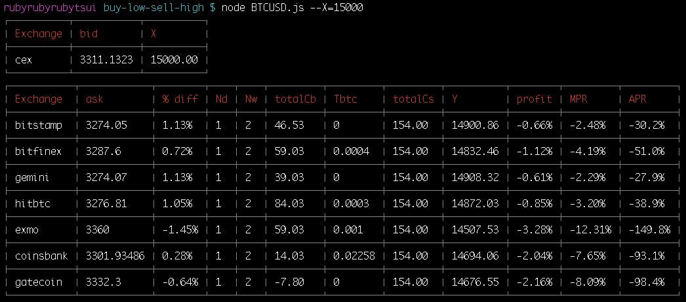

# crypto-exchange-arbitrage

### Install:
```sh
npm install
```

### Use:
```sh
node BTCUSD.js --X=10000  # X is your capital in USD
```

### Output


| Column     | |
|---|---|
| X | Initial Amount (USD) |
| Nd | Number of deposits needed |
| Nw | Number of withdrawals needed |
| totalCb | Total amount of charge spent on deposit, including remittance fee (USD)|
| Tbtc | BTC Withdrawal Charge (BTC)|
| totalCs | Total amount of charge spent on withdrawal (USD) |
| Y | Amount of fiat currency you finally receive (USD) |
| profit | Profit |
| MPR | NORMINAL monthly percentage rate of profit |
| APR | NORMINAL annual percentage rate of profit |

---

## More settings on BTCUSD.js, etc
| Variables     |                                                               |
|---------------|---------------------------------------------------------------|
| X | Initial Amount (USD) |
| Mb | Max. deposit amount in one transfer limited by bank (USD) |
| T | Bank remittance fee (USD) |

### Add BUY exchange
| Variables     |                                                               |
|---------------|---------------------------------------------------------------|
| exchange.fb   | Buy Trade Fee (%)                                             |
| exchange.Cb   | Deposit Charge (USD)                                          |
| exchange.Tbtc | BTC Withdrawal Charge (BTC)                                     |
| exchange.Mb   | Max. deposit amount in one transfer limited by exchange (USD) |

### Add SELL exchange
| Variables     |                                                               |
|---------------|---------------------------------------------------------------|
| sellExchange.fs | Sell Trade Fee (%)                                              |
| sellExchange.Cs | Fiat Withdrawal Charge (USD)                                    |
| sellExchange.Ms | Max. withdrawal amount in one transfer limited by exchange (USD) |
| sellExchange.D  | Number of days the whole roundtrip takes                         |

